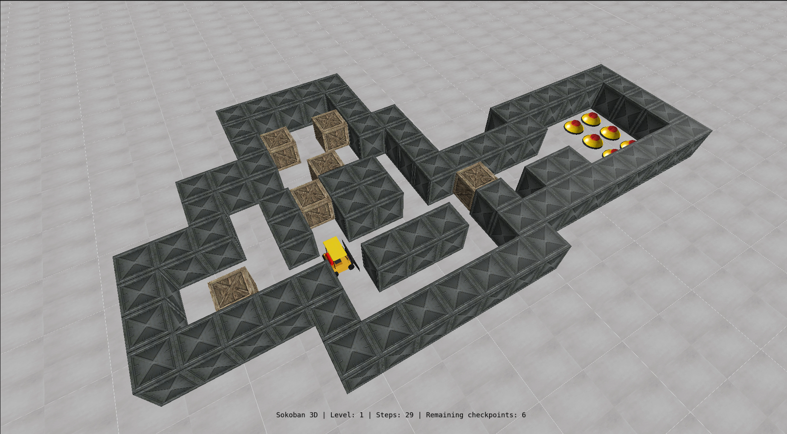
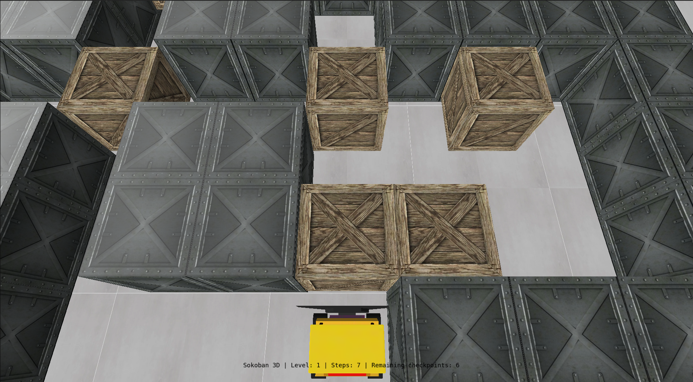

# SOKOBAN 3D

Trabalho desenvolvido para a disciplina de Fundamentos de Computação Gráfica
INF01047 | UFRGS | 2023/2

Alunos:
- Bruno Ferreira Aires (00323680)
- Eduardo Raupp Peretto (00313439)

## Como jogar

O objetivo do jogo é levar todas as caixas aos checkpoints. Quando todos os checkpoints forem alcançados, o nível é finalizado, e o jogador avança para o próximo nível.

O jogador poderá rotacionar a empilhadeira em 90º ao pressionar as teclas `A` (rotação à esquerda) ou `D` (rotação à direita), e então mover-se para a frente, utilizando a tecla `W`.

Ao movimentar-se em direção a uma caixa, caso não haja algum obstáculo impedindo o movimento, a caixa será movimentada naquela direção.

### Atalhos do teclado
- `W`: Move o jogador para a direção em que está apontando.
- `A`: Rotaciona o jogador em 90º à esquerda.
- `D`: Rotaciona o jogador em 90º à direita.
- `Mouse esquerdo`: Ao ser pressionado, altera a angulação da câmera
- `C`: Troca a câmera para modo terceira pessoa/Look at.
- `V`: Troca a câmera para modo livre.
- `S`: Movimenta a câmera para trás (apenas em câmera modo livre).
- `H`: Habilita o debug das matrizes gráficas.
- `R`: Reinicia o nível atual.

## Como compilar e executar

### Windows

Para compilar e executar este projeto no Windows, você possui duas
opções para compilação:

#### Windows com Code::Blocks

Baixe a IDE Code::Blocks em http://codeblocks.org/ e abra o arquivo
"Laboratorio_X.cbp".

**ATENÇÃO**: os "Build targets" padrões (Debug e Release) estão configurados
para Code::Blocks versão 20.03 ou superior, que utiliza MinGW 64-bits. Se você
estiver utilizando versões mais antigas do Code::Blocks (17.12 ou anteriores)
você precisa alterar o "Build target" para "Debug (CBlocks 17.12 32-bit)" ou
"Release (CBlocks 17.12 32-bit)" antes de compilar o projeto.

#### Windows com VSCode (Visual Studio Code)

1) Instale o VSCode seguindo as instruções em https://code.visualstudio.com/ .

2) Instale o compilador GCC no Windows seguindo as instruções em
https://code.visualstudio.com/docs/cpp/config-mingw#_installing-the-mingww64-toolchain .

Alternativamente, se você já possui o Code::Blocks instalado no seu PC
(versão que inclui o MinGW), você pode utilizar o GCC que vem com esta
instalação no passo 5.

3) Instale o CMake seguindo as instruções em https://cmake.org/download/ .
Alternativamente, você pode utilizar algum package manager do
Windows para fazer esta instalação, como https://chocolatey.org/ .

4) Instale as extensões "ms-vscode.cpptools" e "ms-vscode.cmake-tools"
no VSCode. Se você abrir o diretório deste projeto no VSCode,
automaticamente será sugerida a instalação destas extensões (pois
estão listadas no arquivo ".vscode/extensions.json").

5) Abra as configurações da extensão cmake-tools (Ctrl-Shift-P e
busque por "CMake: Open CMake Tools Extension Settings"), e adicione o
caminho de instalação do GCC na opção de configuração "additionalCompilerSearchDirs".

Por exemplo, se você quiser utilizar o compilador MinGW que vem junto
com o Code::Blocks, pode preencher o diretório como
"C:\Program Files\CodeBlocks\MinGW\bin" (verifique se este é o local
de instalação do seu Code::Blocks).

6) Clique no botão de "Play" na barra inferior do VSCode para compilar
e executar o projeto. Na primeira compilação, a extensão do CMake para
o VSCode irá perguntar qual compilador você quer utilizar. Selecione
da lista o compilador GCC que você instalou com o MSYS/MinGW.

Veja mais instruções de uso do CMake no VSCode em:

https://github.com/microsoft/vscode-cmake-tools/blob/main/docs/README.md

### Linux

Para compilar e executar este projeto no Linux, primeiro você precisa instalar
as bibliotecas necessárias. Para tanto, execute o comando abaixo em um terminal.
Esse é normalmente suficiente em uma instalação de Linux Ubuntu:

    sudo apt-get install build-essential make libx11-dev libxrandr-dev \
                         libxinerama-dev libxcursor-dev libxcb1-dev libxext-dev \
                         libxrender-dev libxfixes-dev libxau-dev libxdmcp-dev

Se você usa Linux Mint, talvez seja necessário instalar mais algumas bibliotecas:

    sudo apt-get install libmesa-dev libxxf86vm-dev

Após a instalação das bibliotecas acima, você possui várias opções para compilação:

#### Linux com Makefile

Abra um terminal, navegue até a pasta "Laboratorio_0X_Codigo_Fonte", e execute
o comando "make" para compilar. Para executar o código compilado, execute o
comando "make run".

#### Linux com CMake

Abra um terminal, navegue até a pasta "Laboratorio_0X_Codigo_Fonte", e execute
os seguintes comandos:

    mkdir build  # Cria diretório de build
    cd build     # Entra no diretório
    cmake ..     # Realiza a configuração do projeto com o CMake
    make         # Realiza a compilação
    make run     # Executa o código compilado

#### Linux com VSCode

1) Instale o VSCode seguindo as instruções em https://code.visualstudio.com/ .

2) Instale as extensões "ms-vscode.cpptools" e "ms-vscode.cmake-tools"
no VSCode. Se você abrir o diretório deste projeto no VSCode,
automaticamente será sugerida a instalação destas extensões (pois
estão listadas no arquivo ".vscode/extensions.json").

3) Clique no botão de "Play" na barra inferior do VSCode para compilar
e executar o projeto. Na primeira compilação, a extensão do CMake para
o VSCode irá perguntar qual compilador você quer utilizar. Selecione
da lista o compilador que você deseja utilizar.

Veja mais instruções de uso do CMake no VSCode em:

https://github.com/microsoft/vscode-cmake-tools/blob/main/docs/README.md

#### Linux com Code::Blocks

Instale a IDE Code::Blocks (versão Linux em http://codeblocks.org/), abra o
arquivo "Laboratorio_X.cbp", e modifique o "Build target" de "Debug" para "Linux".

### macOS

Para compilar e executar esse projeto no macOS, primeiro você precisa instalar o
HOMEBREW, um gerenciador de pacotes para facilitar a instação de bibliotecas. O
HOMEBREW pode ser instalado com o seguinte comando no terminal:

    /usr/bin/ruby -e "$(curl -fsSL https://raw.githubusercontent.com/Homebrew/install/master/install)"

Após a instalação do HOMEBREW, a biblioteca GLFW deve ser instalada. Isso pode
ser feito pelo terminal com o comando:

    brew install glfw

#### macOS com Makefile

Abra um terminal, navegue até a pasta "Laboratorio_0X_Codigo_Fonte", e execute
o comando "make -f Makefile.macOS" para compilar. Para executar o código
compilado, execute o comando "make -f Makefile.macOS run".

Observação: a versão atual da IDE Code::Blocks é bastante desatualizada pra o
macOS. A nota oficial dos desenvolvedores é: "Code::Blocks 17.12 for Mac is
currently not available due to the lack of Mac developers, or developers that
own a Mac. We could use an extra Mac developer (or two) to work on Mac
compatibility issues."

#### Soluções de Problemas

Caso você tenha problemas em executar o código deste projeto, tente atualizar o
driver da sua placa de vídeo.

## Processo de desenvolvimento
O trabalho foi desenvolvido pelos membros Bruno e Eduardo, durante a disciplina de Fundamentos de Computação Gráfica. Ambos membros desenvolveram baseando-se fortemente nos conceitos teóricos e práticos, sobretudo construídos durante os laboratórios da disciplina. Portanto, parte do código implementado para o Sokoban 3D possui influência direta dos códigos fornecidos pelo professor durante a disciplina, especialmente para, por instância, inicialização de módulos OpenGL, carregamento de texturas, construção das matrizes gráficas, aplicação de transformações geométricas, e algoritmos vistos em aula, como a curva de Bezier cúbica.

Ambos membros fizeram usos pontuais de IAs generativas como o ChatGPT, mas limitando-se apenas a:
    - Entendimento de código (ex: fornecidos em laboratórios)
    - Entendimento de como editar o código para expandir funcionalidades
    - Encontrar bugs e problemas nos códigos desenvolvidos, e como resolvê-los
    - Questionamentos específicos sobre C++ (ex: como criar classes, interfaces, iterações)
    - Geração de pseudo-códigos
Cabe ressaltar que nenhum código presente neste projeto foi diretamente gerado por IA generativa. Ainda assim, destacamos que esse tipo de ferramenta auxiliou bastante a equipe no entendimento e direcionamento do desenvolvimento.

## Contribuições dos membros
O desenvolvimento foi executado de maneira colaborativa, com reuniões de alinhamento e pair programming. No entanto, cada membro ficou responsável por diferentes funcionalidades no projeto. Abaixo, segue a listagem de implementações que cada membro liderou:
* Bruno:
    - Criação dos níveis
    - Movimentação do personagem
    - Cêmeras look at e terceira pessoa
    - Criação de texturas
    - Modelagem de objetos
    - Modelos de iluminação e interpolação
    - Colisão ponto-esfera e ponto-plano
    - Leitura dos arquivos de nível
    - Animações
* Eduardo:
    - Spawn de caixas no cenário
    - Classe englobar objetos cúbicos (RectangularObject)
    - Hitboxes
    - Colisão AABB - Player com caixa, caixa com caixa, player com parede
    - Movimentação de caixas
    - Spawn de checkpoints
    - Teste inicial de colisão entre caixas e checkpoints
    - Makefile
    - Free camera 
    - Curva de Bezier cúbica na inicialização do level
    - UI com informações do level atual

## Vídeo demonstrativo
https://www.youtube.com/watch?v=Fa7m7uzSQfk
